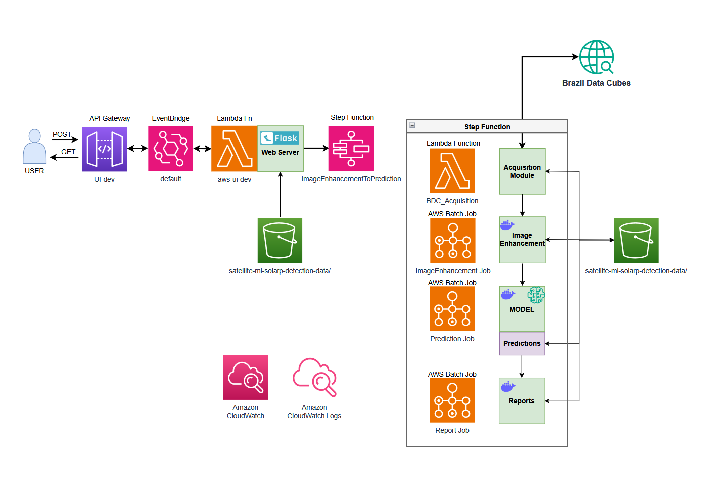
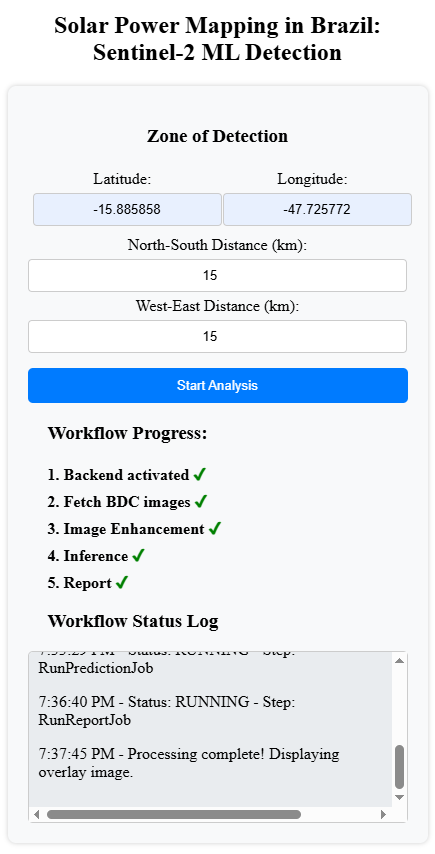
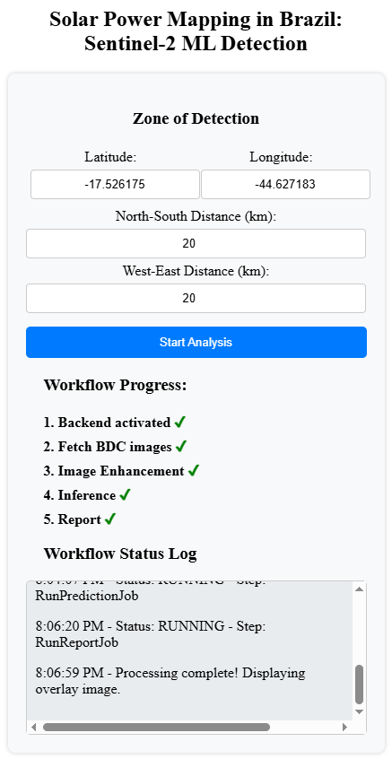

# **AWS-Based Deployment for a Solar Plant Detection from Satellite Imagery**

## **Overview**
This repository implements an end-to-end Machine Learning pipeline for automating the detection of solar plants across Brazil using Sentinel-2 satellite imagery. The system automates **data acquisition, image enhancement, model inference, and report generation**, leveraging AWS services for scalable and cost-effective deployment.

## **System Architecture**
The workflow is orchestrated using **AWS Step Functions**, with **AWS Lambda** functions and jobs executed via **AWS Batch**. It includes the following components:

<div align="center">

</div>


1. **User Interface (UI):** A Flask backend and a simple web application allowing users to input coordinates and define search parameters.
2. **Acquisition Module (BDC_Acquisition):** Fetches **Sentinel-2 imagery** from **Brazil Data Cubes** using an AWS Lambda function.
3. **Image Enhancement Module:** Processes raw images to enhance clarity using advanced filtering and bi-cubic interpolation techniques.
4. **Prediction Module:** Uses a **U-Net deep learning model** to perform semantic segmentation for solar plants detection.
5. **Report Generation:** Generates composite **overlays** by mosaicking input and predicted images, accessible via a downloadable report.

## **Repository Structure**
```
AWS-ML_Satellite_Deployment/
│   .gitignore
│   README.md
│
├── models/
│   ├── Model_inference.ipynb   # Test Notebook for running the trained model inference
├── doc/
│   ├── Deployment_Plan.pdf 
│   ├── Deployment_Solution_Architecture.pdf
├── src/
│   ├── acquisition/
│   │   ├── BDC_Fetch.py        # Fetches images from Brazil Data Cube
│   │
│   ├── AWS.settings/
│   │   ├── step-function-definition.json  # AWS Step Function configuration (orchestrator)
│   │   ├── trust-policy.json  # IAM Trust Policy for AWS Batch roles
│   │
│   ├── detection/
│   │   ├── Dockerfile  # Docker setup for the prediction module
│   │   ├── prediction.py  # Python app for the prediction Docker module
│   │
│   ├── enhancement/
│   │   ├── Dockerfile  # Docker setup for image enhancement module
│   │   ├── Image_Enhancement.py  # Python app for the image-enhancement Docker module
│   │
│   ├── report/
│   │   ├── Dockerfile  # Docker setup for report module
│   │   ├── report.py  # Python app for the report Docker module
│   │
│   ├── UI/
│   │   ├── app.py  # Flask backend server
│   │   ├── templates/index.html  # JavaScript / HTML frontend for UI
│   │
│   └── utils/
│       ├── utils.py  # Utility functions for data handling
│       ├── transaction_id_gen/
│       │   ├── counter.txt  # transaction IDs counter file
│
└── tests/
    ├── BDC_Fetch.ipynb  # Tests the Brazil Data Cube acquisition
    ├── ID_Gen.ipynb  # transaction ID generation
    ├── Image_Enhancement.ipynb  # Tests image processing module
    ├── Report.ipynb  # Tests report generation module
    ├── median_composite.tif  # Sample processed satellite image
```

## **Deployment Workflow**
The system is deployed using **AWS Step Functions**, connecting multiple AWS services:

1. **User Input (API Gateway + AWS Lambda):** The user provides latitude, longitude, and distance parameters. Frontend: JavaScript + HTML | Backend: Flask + Python.
2. **Data Acquisition (AWS Lambda):** Fetches Sentinel-2 data.
3. **Image Processing (AWS Batch Job):** Enhances satellite images.
4. **Model Prediction (AWS Batch Job):** Identifies solar panels.
5. **Report Generation (AWS Batch Job):** Creates overlays and statistics.
6. **Results Retrieval (S3 & Flask UI):** Users can download reports via the web app.

## **Running the System**

The demo application is deployed on AWS, and because the resources used are paid, access is limited to manage operating costs. However, if you're interested in trying the tool, feel free to reach out - I'll be happy to share the access link.

📧 Email: federico.bessi@gmail.com  
🔗 GitHub: [github.com/FederCO23](https://github.com/FederCO23)  
💼 LinkedIn: [Federico Bessi](https://www.linkedin.com/in/federicobessi/)

## 🌍 **Sample Results from Satellite-Based Detection**
This project includes a semantic segmentation model that analyzes Sentinel-2 satellite images to detect photovoltaic solar plants. Below are sample outputs showing the effectiveness of the model.

The left images show the input variables. The right images displays the model’s prediction in a overlay image highlighting the detection in cyan color.

🛰️ Example 1: Taboquinha DF Solar Plant
<p align="center">   </p>

🛰️ Example 2: Hélio Valgas Solar Plant
<p align="center">   </p>


## **Future Improvements**
- **Optimize inference speed** using more powerful GPUs (limited in this project considering Budget constraints).
- **Postprocessing** use connected component filtering to remove very small predictions. Filtering noise with area-based rules.
- **Improve the web UI** for better user experience.
- **Add time filtering** for time-line analysis.
